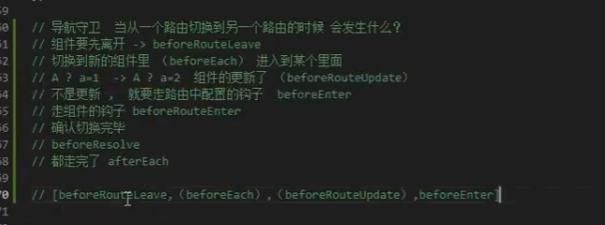

## Vue.use(VueRouter)如何实现
 Vue.use会进行判断
 如果传入的参数是一个函数，那么就会执行这个函数
 如果传入的参数上有install方法，会优先调用这个install方法
 
 ```js
 function initUse(Vue) {
     Vue.use = function (plugin) {
         var installedPlugins = this._installedPlugins || (this._installedPlugins = []);
         if (installedPlugins.indexOf(plugin) > -1) {
             return this;
         }
         // additional parameters
         var args = toArray(arguments, 1);
         args.unshift(this);
		 // 如果plugin.install是函数 优先执行
         if (isFunction(plugin.install)) {
             plugin.install.apply(plugin, args);
         }
		 // 否则执行执行plugin方法 
         else if (isFunction(plugin)) {
             plugin.apply(null, args);
         }
		 
		 // 将这个插件加入到栈中
         installedPlugins.push(plugin);
		 
		 // 返回Vue构造函数
         return this;
     };
 }
 ```

## 前端路由和后端路由
1. 后端路由
前端提交表单元素，服务端根据前端提交的内容在服务端发生跳转或重定向，服务端生成对应的html文件直接返回

2. 前端路由
由前端控制跳转，根据浏览器地址栏中的路径path不同渲染不同组件
好处1：路径变化不会想服务端发起请求
好处2：不会刷新页面，用户体验好
好处3：产生历史记录可以管理前进与后退

## hash路由和history路由
1. hash路由
原理就是根据hash值的不同可以渲染不同组件
通过window.location.hash可以手动指定地址栏的切换
通过监听popstate事件来感知到hash值的变化
也可以通过监听hashchange事件来感知，兼容性比较好
不需要服务端支持 就算强制刷新 也不会出现404的情况

问题：
hash路由丑，几乎所有大网站都不会用，每个地址都带一个#
服务器无法获取到锚点，也就是"#/xxx"的内容，服务端也就无法基于路由来解析内容，不利于网页爬虫seo优化
在前端路由模式下，我们查看网页源代码会发现只有一个空的di id=app的标签 对于seo来说没有任何价值

2. history路由
是HTML5提供的api，地址栏中没有#号
可以基于浏览器提供的一系列api来改变路径
+ go 前进若干个
+ back 后退一个
+ forward 前进一个
+ replaceState方法 重定向路径 会覆盖之前的路由信息 等于先取出来 然后放进去 
+ pushState方法 切换路径 会在栈中留下历史信息
参数data 携带的信息 默认为{}
参数title 标题
参数url 路径

问题1：强制刷新时会携带路径，需要服务端支持
按下回车之后或者手动刷新页面之后，前端会携带当前地址栏中的path去向后端访问，而hash路由是不会携带的
如果服务端有这个路径：
服务器就可以获取到路径进行解析，从而为服务端渲染ssr提供了可能，从而可以基于此路径来返回对应的html页面，友好seo优化

如果服务端没有此路径：
页面就会报错 比如404 所以这个模式需要服务端支持 

问题2：兼容性不好


## 服务端渲染ssr 待学习
## 组件的name属性有什么意义
## 注意点
1. 子路由children中的path配置项不能加/
2. 可以使用jsx来写组件模板 但是要在render方法的参数中加上h方法
3. 二级路由

## Vue的权限设计
动态路由 + 路由导航守卫

## 导航守卫流程

## 导航守卫实现原理

## $route和$router的区别
